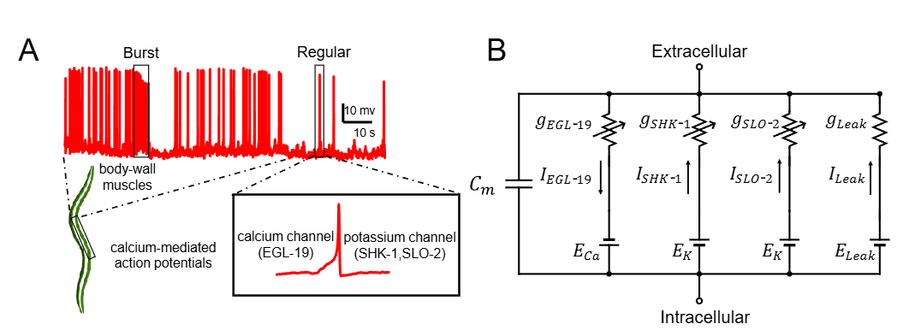

# Hodgkin-Huxley Based Model for C.elegans Body Wall Muscle Cell 

Code for paper [**Hodgkin-Huxley Based Model for C.elegans Body Wall Muscle Cell **](https://www.biorxiv.org/content/10.1101/2024.07.15.603498v1).



## Requirements

### Python

- Neuronal dynamics simulation: numpy, brian2
- Neuron and network parameter estimation: numpy, sbi, matplotlib, scipy, sci-kit learn


### Install dependencies

```bash
# new python environment for pytorch
conda create -n winter_school python=3.11
# activate the new environment
conda activate winter_school
# install basic packages for scientific computing
conda install -y numpy matplotlib scipy scikit-learn jupyter ipython pandas ipywidgets 
# Install the latest version of BrainPy:
pip install brainpy -U
# CPU installation for Linux, macOS and Windows
pip install --upgrade brainpylib
# CUDA 12 installation for Linux only
pip install --upgrade brainpylib-cu12x
# CUDA 11 installation for Linux only
pip install --upgrade brainpylib-cu11x
# Install the latest version of jaxlib(CPU):
pip install -U "jax[cpu]"
# Install the latest version of jaxlib(NVIDIA GPU on x86_64):
# CUDA 11 installation
pip install -U "jax[cuda11_pip]" -f https://storage.googleapis.com/jax-releases/jax_cuda_releases.html
# CUDA 12 installation
pip install -U "jax[cuda12_pip]" -f https://storage.googleapis.com/jax-releases/jax_cuda_releases.html
# install taichi
pip install taichi==1.7.0
# open a local jupyter notebook
jupyter notebook

# extra package
# sbi installation
pip install sbi
```

Install additional packages for running body-wall muscle cell model:
```bash
pip install --upgrade "jax[cpu]"
pip install -U brainpy
pip install brainpylib
pip install -U "ray[default]"

## Reproduce figures in the maintext

1. Figure 2:
    ```bash
    ./code4paper/pm_scan_kl_HH10.py
    ```
2. Figure 3:
    ```bash
    ./code4paper/pm_scan_kl_HH10.py
    ```
3. Figure 4:
    ```bash
    ./code4paper/HH100_recon_pnas.py
    ```